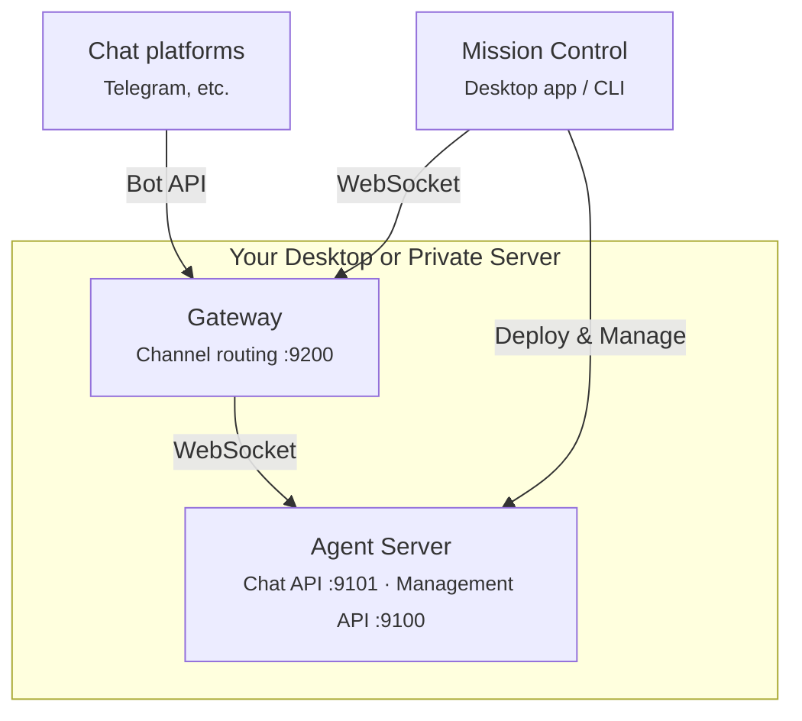

# Dash — Your AI Team, Always On

[](https://github.com/volumegambit/Dash/actions/workflows/ci.yml)
[](https://nodejs.org)
[](https://www.typescriptlang.org)
[](https://developer.mozilla.org/en-US/docs/Web/JavaScript/Guide/Modules)
[](https://biomejs.dev)
[](https://vitest.dev)
[](https://www.docker.com)
[]()

> **⚠️ Alpha Software** — Dash is under heavy development. APIs, configuration, and features may change without notice. Use at your own risk and expect rough edges.

DashSquad.ai (Dash) lets anyone run a team of AI agents that work autonomously — handling tasks, making decisions, and getting things done — so you don't have to.

Whether you're a solo operator or managing a team, Dash puts a crew of AI agents to work for you. Define what they do, set them loose, and check back on results.

> Agents that coordinate with each other, delegate subtasks, and work in parallel are on the way. The groundwork is already in place — stay tuned.

## What You Get

- **Your team, your tools** — Connect your agents to Anthropic, OpenAI, Google, or any major LLM provider
- **Mission Control** — A desktop app to manage your agent team, monitor activity, and chat with agents directly
- **CLI & automation** — Power users can manage agents from the terminal or wire them into automated workflows
- **Runs anywhere** — Your machine, a VPS, or a private cloud. Your data never leaves your computer except to your chosen AI provider
- **Channels** — Reach your agents through Telegram, a WebSocket API, or the built-in chat interface
- **Safe by default** — Secrets encrypted at rest, agents sandboxed, access controlled

## Quick Start

Get your team running in minutes.

### Prerequisites

- Node.js 22+
- An Anthropic API key

### Setup

```bash
git clone <repo-url> && cd Dash
npm install
cp -r config.example config
# Edit config/credentials.json with your API key
# Edit config/dash.json for agent settings
```

### Run the TUI

```bash
npm run tui
```

### Run the agent server

```bash
# Set tokens in .env to enable the APIs
MANAGEMENT_API_TOKEN=your-mgmt-token
CHAT_API_TOKEN=your-chat-token

npm run dev
```

### Run (Docker)

```bash
docker compose up --build
```

## Architecture



Dash has three main components. They can all run on a single machine or split across machines — the agent server and gateway on a VPS, Mission Control on your laptop:

- **Agent server** — hosts agents and exposes two APIs: a Chat API (WebSocket, port 9101) for real-time interaction and a Management API (HTTP, port 9100) for health checks and shutdown. Each API uses its own auth token. Runs on a VPS, private cloud, or local machine.
- **Gateway** — connects to external chat platforms (Telegram, etc.) and routes messages to agents via the Chat API. Mission Control's chat panel also connects through the gateway. One process, one config file for all channels. Runs alongside the agent server.
- **Mission Control** — desktop app or CLI for deploying, monitoring, and chatting with agents. Connects to the gateway for chat (WebSocket, port 9200) and to agent servers for monitoring (HTTP, port 9100). Includes a built-in TUI for terminal-based interaction. Runs on your local machine.

## Packages

**Libraries** (`packages/`) — ordered by dependency layer, foundational first:

| Package | What it does |
|---------|-------------|
| `@dash/llm` | Wraps LLM provider SDKs (Anthropic) behind a streaming interface |
| `@dash/agent` | Runs the agentic loop — tool execution, session persistence, orchestration |
| `@dash/channels` | Routes messages from channel adapters (Telegram, MC) to agents |
| `@dash/chat` | Exposes agents over WebSocket for real-time streaming (port 9101) |
| `@dash/management` | HTTP endpoints for health checks, server info, and shutdown (port 9100) |
| `@dash/mc` | Manages agent deployments, encrypted secrets (AES-256-GCM), process runtime, and remote connections for Mission Control |

**Apps** (`apps/`) — things you run:

| Package | What it does |
|---------|-------------|
| `@dash/agent-server` | Headless server that wires up agents and starts the management + chat APIs |
| `@dash/gateway` | Channel gateway — routes Telegram, MC chat, and other channels to agents |
| `@dash/tui` | Built-in terminal interface within Mission Control for quick agent interaction |
| `@dash/mission-control` | Desktop app for managing your agent team and chatting with agents directly (Electron + React) |
| `@dash/mc-cli` | CLI equivalent of Mission Control — `deploy`, `status`, `stop`, `remove`, `logs`, `health`, `info`, `secrets`, `lock`, `unlock` |

## Project Structure

```
Dash/
├── packages/
│   ├── llm/          # LLM provider abstraction
│   ├── agent/        # Agent runtime, tools, sessions
│   ├── channels/     # Channel adapters (Telegram, MC) + message router
│   ├── chat/         # Chat API (WebSocket server)
│   ├── management/   # Management API (HTTP server)
│   └── mc/           # Deployment registry, encrypted secrets store
├── apps/
│   ├── dash/         # Agent server entry point, config
│   ├── gateway/      # Channel gateway (routes channels to agents)
│   ├── tui/          # Terminal UI
│   ├── mc-cli/       # Mission Control CLI
│   └── mission-control/  # Mission Control desktop app (Electron)
├── config.example/
│   ├── credentials.json  # Credential placeholders
│   └── dash.json         # Default agent configuration
├── config/           # User's runtime config (gitignored)
├── data/
│   └── sessions/     # JSONL session files (persisted)
├── docker-compose.yml
├── Dockerfile
└── vitest.config.ts
```

## Configuration

### Credentials

**Mission Control (recommended):** Secrets are stored in an encrypted file at `~/.mission-control/secrets.enc` (AES-256-GCM, password-derived key via scrypt). The derived key is cached in your OS keychain so you only enter your password once per session.

```bash
npm run mc-cli -- secrets set anthropic-api-key    # Prompts for value
npm run mc-cli -- secrets list                     # Show stored key names
npm run mc-cli -- secrets get anthropic-api-key    # Show masked value
npm run mc-cli -- lock                             # Clear keychain cache
```

**Agent server / TUI:** Use environment variables or `config/credentials.json`:

```
ANTHROPIC_API_KEY=sk-ant-...
MANAGEMENT_API_TOKEN=your-mgmt-token
CHAT_API_TOKEN=your-chat-token
```

Or `config/credentials.json` (gitignored):

```json
{
  "anthropic": { "apiKey": "sk-ant-..." }
}
```

For manual deployments, use `--secrets` to pass a temporary secrets file that is deleted after reading:

```bash
node apps/dash/dist/index.js --config /path/to/dash.json --secrets /path/to/secrets.json
```

### Agent Config (`config/dash.json`)

Define named agent profiles with model, system prompt, tools, and token limits:

```json
{
  "agents": {
    "default": {
      "model": "claude-sonnet-4-20250514",
      "tools": ["bash", "read_file"],
      "maxTokens": 4096
    }
  }
}
```

## Documentation

Full documentation is available at [docs.dashsquad.ai](https://docs.dashsquad.ai), or in the [`user_docs/`](user_docs/) directory:

- [Getting Started](user_docs/getting-started.mdx) — install, configure, first run
- [Configuration](user_docs/configuration.mdx) — `dash.json` schema, env vars, defaults
- [Tools](user_docs/tools.mdx) — bash and read_file: parameters, sandboxing, limits
- [Channels](user_docs/channels.mdx) — TUI usage, Chat API protocol
- [Extended Thinking](user_docs/extended-thinking.mdx) — budget tuning, constraints
- [Architecture](user_docs/architecture.mdx) — package map, data flow, session format
- [Troubleshooting](user_docs/troubleshooting.mdx) — common errors, debugging tips

## Development

```bash
npm run build         # Build all packages and apps (tsup)
npm run dev           # Dev server (apps/dash via tsx)
npm run tui           # Terminal UI (apps/tui via tsx)
npm run gateway       # Channel gateway (pass --config <path>)
npm run mc-cli        # Mission Control CLI (apps/mc-cli via tsx)
npm run mc:dev        # Mission Control desktop app (dev mode)
npm run mc:build      # Mission Control desktop app (production build)
npm test              # Run all tests (vitest)
npm run lint          # Biome check
npm run lint:fix      # Biome auto-fix
npm run clean         # Remove dist/ from all packages and apps
npm run version:sync  # Sync root version to all packages and apps
```

### Tooling

| | Choice |
|-|--------|
| Runtime | Node.js 22+ (ESM) |
| Build | tsup |
| Lint/Format | Biome |
| Test | Vitest |
| Telegram | grammY |
| WebSocket | @hono/node-ws |
| Desktop | Electron + React |
| Sessions | JSONL (append-only) |
| Logging | pino |
| Docker | node:22-slim, multi-stage |

## License

Private
