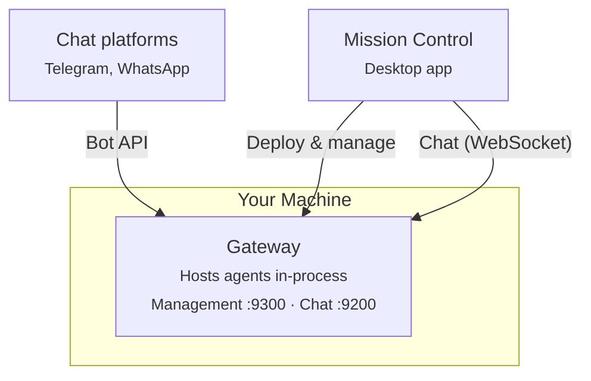

# Atrium — The space where your work comes together.

[](https://github.com/volumegambit/Dash/actions/workflows/ci.yml)
[](https://nodejs.org)
[](https://www.typescriptlang.org)
[]()

> **Early Access** — Atrium is under active development. Expect rough edges and breaking changes.

Atrium is the personal operating system for people who build. AI agents that learn, remember, and compound your advantage — in a space that's entirely yours.

Atrium lets anyone deploy AI agents that work autonomously — handling tasks, making decisions, and getting things done — so you don't have to.

## Quick Start

### Prerequisites

- Node.js 22+
- An API key from Anthropic, OpenAI, or Google

### Install and Run

```bash
git clone <repo-url> && cd Dash
npm install
npm run build
npm run mc:dev
```

This opens **Mission Control** — the desktop app where you set up everything:

1. **Create a password** — encrypts your API keys at rest
2. **Add an AI provider** — paste your Anthropic/OpenAI/Google API key
3. **Deploy an agent** — pick a model, give it a system prompt, choose its tools
4. **Chat** — talk to your agent directly from Mission Control

All configuration (API keys, agent settings, tools, messaging apps) is managed from within Mission Control. No config files to edit.

## What You Get

- **Your team, your tools** — Connect agents to Anthropic, OpenAI, Google, or any major LLM provider
- **Mission Control** — Desktop app to deploy agents, manage settings, and chat directly
- **Channels** — Reach your agents through Telegram, WhatsApp, or the built-in chat
- **Runs locally** — Your machine, your data. Nothing leaves except API calls to your chosen provider
- **Safe by default** — Secrets encrypted at rest (AES-256-GCM), agents sandboxed

## Architecture



**Gateway** — single process that hosts all agents, handles chat via WebSocket, and connects to external chat platforms. Started automatically by Mission Control.

**Mission Control** — Electron desktop app for deploying, configuring, monitoring, and chatting with agents. Spawns and manages the gateway.

## Development

```bash
npm run build         # Build all packages and apps
npm run mc:dev        # Mission Control (dev mode)
npm run mc:build      # Mission Control (production build)
npm run gateway       # Gateway standalone (pass --config <path>)
npm test              # Run all tests
npm run lint          # Biome check
npm run lint:fix      # Biome auto-fix
```

### Packages

| Package | Purpose |
|---------|---------|
| `packages/llm` | LLM provider abstraction (Anthropic, OpenAI, Google) |
| `packages/agent` | Agent runtime — tool execution, sessions, conversation pool |
| `packages/mcp` | MCP server client for connecting external tools |
| `packages/channels` | Channel adapters (Telegram, WhatsApp) + message router |
| `packages/chat` | WebSocket chat server |
| `packages/management` | HTTP management API |
| `packages/mc` | Mission Control core — deployments, encrypted secrets, gateway client |
| `apps/gateway` | Agent runtime + channel gateway |
| `apps/mission-control` | Desktop app (Electron + React) |

## Documentation

Full docs at [docs.atrium.ai](https://docs.atrium.ai), or in [`docs/`](docs/).

## License

Private
