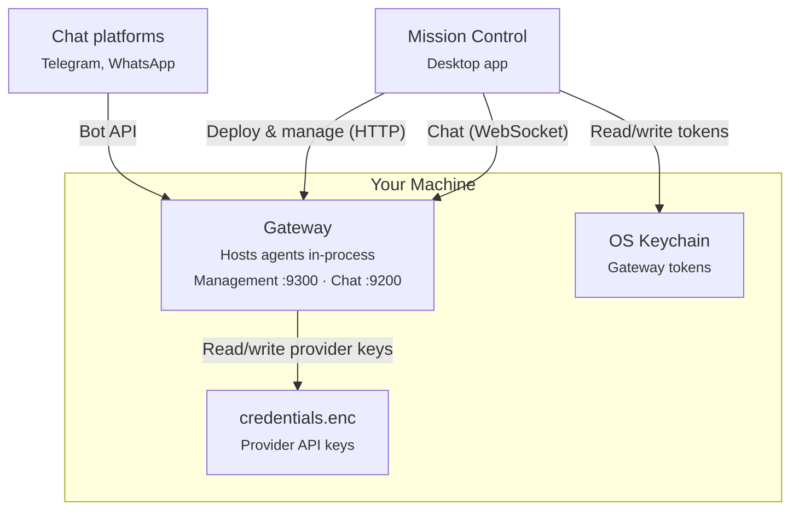

# Dash

[](https://github.com/volumegambit/Dash/actions/workflows/ci.yml)
[](https://nodejs.org)
[](https://www.typescriptlang.org)
[]()

> **Early Access** — Dash is under active development. Expect rough edges and breaking changes.

Dash is a local-first runtime for deploying AI agents. Everything runs on your machine: the agents, their tools, their conversations. You manage them from **Mission Control**, a desktop app that spawns a background gateway process and gives you a UI to deploy, chat with, and supervise agents. The only outbound traffic is to the LLM provider you pick.

## Setting Up Mission Control

### 1. Prerequisites

- **Node.js 22+** (check with `node -v`)
- An API key from **Anthropic**, **OpenAI**, or **Google**
- macOS, Windows, or Linux (macOS is the best-tested path during early access)

### 2. Clone, install, launch

```bash
git clone https://github.com/volumegambit/Dash.git
cd Dash
npm install
npm run build
npm run mc:dev
```

`npm run mc:dev` opens Mission Control in development mode (hot-reload on renderer changes). For a production-style launch: `npm run mc:build && npm run mc:preview`.

### 3. First-run wizard

On first launch, Mission Control walks you through three steps. The whole thing takes under a minute.

1. **Gateway start.** MC spawns the background gateway process (`apps/gateway`) as a detached child. You'll see a brief spinner while it comes up on port 9300 (management) and 9200 (channels). No prompts — the gateway is MC's child and is supervised automatically across restarts. Its management + chat tokens live in the OS keychain (macOS Keychain / Windows Credential Manager / libsecret on Linux), never in a plaintext file on disk.
2. **Pick a provider.** Choose Anthropic, OpenAI, or Google. You can add more providers later from the *AI Providers* tab.
3. **Paste your API key.** MC sends the key directly to the gateway's encrypted credential store (AES-256-GCM, key derived via OS keychain). MC itself never stores it. The key is masked in the input field to block shoulder-surfing.

When the wizard finishes you're in Mission Control proper.

### 4. What to do next

- **Deploy your first agent** — *Agents → Deploy*. Pick a model from the dropdown (populated live from the provider's `/v1/models` endpoint, filtered through a curated allow-list), give it a name + system prompt, and choose which tools it can use.
- **Chat with it** — *Chat → New Conversation*. Messages stream over a WebSocket directly to the gateway, no round-trip through a cloud service.
- **Reach it from Telegram or WhatsApp** — *Messaging Apps → Connect*. Paste a bot token (Telegram) or scan a QR code (WhatsApp) and your agent starts receiving messages from those platforms.
- **Give it more tools** — *Connectors → Add Connector*. Install any Model Context Protocol (MCP) server (Linear, GitHub, a local filesystem, anything from the [MCP ecosystem](https://modelcontextprotocol.io)) and its tools become available to your agents.

All configuration lives inside Mission Control. There are no config files to hand-edit for day-to-day use.

## What You Get

- **Local-first** — Agents run on your machine. The only outbound network calls are to the LLM provider you chose.
- **Encrypted secrets at rest** — Provider API keys sit in `credentials.enc` (AES-256-GCM), gated by a key cached in the OS keychain. Gateway management tokens also live in the keychain.
- **Tools + MCP** — Built-in tools (files, shell, fetch, web search) plus any MCP server you plug in.
- **Messaging channels** — Agents can listen on Telegram, WhatsApp, or the built-in chat WebSocket.
- **Gateway supervisor** — MC automatically restarts a crashed gateway and never silently kills processes it didn't spawn.

## Architecture



**Gateway** — Single long-running process that hosts all agents in memory, serves the chat WebSocket at `/ws/chat`, exposes an HTTP management API at port 9300, and connects to external messaging platforms. Mission Control spawns it automatically on first launch and reuses it across MC restarts — the bearer token lives in the OS keychain, so a relaunched MC recognizes its own gateway without a fresh spawn.

**Mission Control** — Electron desktop app. Main process hosts the supervisor that manages the gateway lifecycle, renderer is a React + Vite UI talking to the main process over IPC.

## Development

```bash
npm run build          # Build all packages and apps (tsup)
npm run mc:dev         # Mission Control (dev mode, hot-reload)
npm run mc:build       # Mission Control (production build)
npm run mc:package     # Mission Control (package for distribution)
npm run gateway        # Gateway standalone (pass --config <path>)
npm test               # Full test suite (vitest)
npm run lint           # Biome check
npm run lint:fix       # Biome auto-fix
npm run clean          # Remove dist/ from all packages and apps
```

For the full development guide — coding conventions, testing strategy, git workflow, versioning rules — see [`CLAUDE.md`](CLAUDE.md).

### Packages

| Package | Purpose |
|---------|---------|
| `packages/models` | LLM provider definitions + curated allow-list (Anthropic, OpenAI, Google) |
| `packages/agent` | Agent runtime — tool execution, sessions, conversation pool |
| `packages/mcp` | Model Context Protocol client for external tool servers |
| `packages/channels` | Channel adapters (Telegram, WhatsApp) + message router |
| `packages/chat` | WebSocket chat server |
| `packages/management` | HTTP management API client |
| `packages/mc` | Mission Control core — gateway supervisor, keychain store, state |
| `packages/logging` | Structured logging primitives |

### Apps

| App | Purpose |
|-----|---------|
| `apps/gateway` | Agent runtime + channel gateway (Node process spawned by MC) |
| `apps/mission-control` | Electron desktop app (main + renderer + preload) |
| `apps/mc-cli` | Command-line companion for scripted operations |

## Documentation

- **User guide** — [dash-aa8db5b5.mintlify.app/introduction](https://dash-aa8db5b5.mintlify.app/introduction)
- **In-repo docs** — [`docs/`](docs/)
- **Developer guide** — [`CLAUDE.md`](CLAUDE.md)

## License

Private
