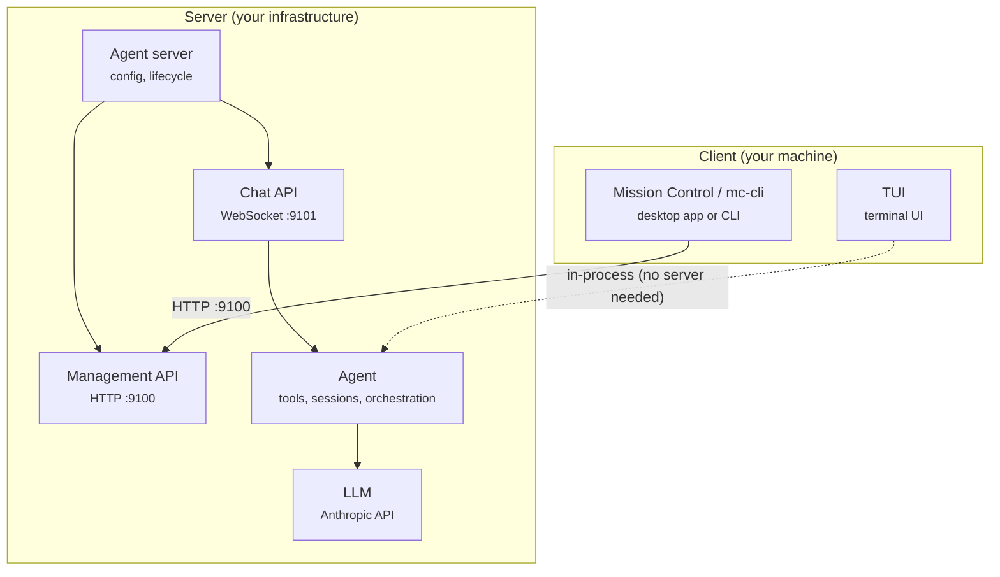

Dash is a TypeScript monorepo for deploying autonomous AI agents. It runs as a headless server with two APIs, or as a standalone terminal UI.

## System overview



Dash has three components that can run on different machines:

- **Agent server** — runs on your infrastructure (a VPS, private cloud, or local machine). This is the main deployment target. It reads your config, creates agents with their assigned models and tools, and starts two APIs: the Chat API (WebSocket, port 9101) for real-time interaction, and the Management API (HTTP, port 9100) for health checks, server info, and shutdown.
- **TUI** — runs on your local machine. A standalone terminal interface that connects to an agent in-process, with no network involved. Best for development and quick experimentation.
- **Mission Control** — runs on your local machine. A desktop app (Electron) or CLI for monitoring and managing remote agent servers. Connects to one or more agent servers over HTTP via the Management API.

### Deployment options

**Single machine** — run everything locally. Start the agent server and use the TUI or connect to the Chat API from `localhost`. Good for development and personal use.

**Multi-machine** — run the agent server on a VPS or private cloud, and use Mission Control from your laptop to manage it. The Chat API and Management API are the only network-facing surfaces, each protected by its own auth token. You can manage multiple agent servers from a single Mission Control instance.

## Components

<AccordionGroup>
  <Accordion title="LLM layer" icon="microchip">
    Abstraction over LLM provider APIs. Currently supports Anthropic (Claude). Handles streaming responses, extended thinking blocks, and tool use blocks. Model names are resolved to providers automatically — any model starting with `claude-` routes to Anthropic.
  </Accordion>
  <Accordion title="Agent" icon="robot">
    The core runtime. An agent manages conversations: it loads session history, sends messages to the LLM, executes tools when the model requests them, and persists everything to disk. Agents loop automatically — if the model asks to run a tool, the agent executes it and sends the result back until the model produces a final response (up to 25 rounds).
  </Accordion>
  <Accordion title="Chat API" icon="comments">
    WebSocket server (port 9101) for real-time agent interaction. Clients connect, send messages, and receive a stream of events (text deltas, tool executions, final responses) as they happen. Supports multiple concurrent conversations on a single connection via message ID correlation.
  </Accordion>
  <Accordion title="Management API" icon="tower-control">
    HTTP server (port 9100) for operational control. Provides health checks (`/health`), server info (`/info`), and graceful shutdown (`/lifecycle/shutdown`). Used by Mission Control to monitor and manage remote deployments.
  </Accordion>
  <Accordion title="Agent server" icon="server">
    The main entry point. Reads config files and environment variables, creates agents with their assigned models and tools, and starts both the Chat API and Management API. Supports `--config` and `--secrets` CLI flags for production deployments.
  </Accordion>
  <Accordion title="TUI" icon="terminal">
    An interactive terminal interface. Connects directly to an agent in-process — no server needed. Useful for local development and quick experimentation. Renders streaming output with formatting, shows tool executions, and displays token usage.
  </Accordion>
  <Accordion title="Mission Control" icon="grid-2">
    Desktop app (Electron) and CLI for managing agent deployments across machines. Stores deployment records and secrets locally, connects to remote agent servers via their management APIs. The CLI provides `health` and `info` commands; the desktop app adds a visual interface.
  </Accordion>
</AccordionGroup>

## Two-server model

The agent server runs two separate servers with independent authentication:

| Server | Protocol | Default port | Auth | Purpose |
|--------|----------|-------------|------|---------|
| Management API | HTTP | 9100 | Bearer token (`MANAGEMENT_API_TOKEN`) | Health checks, info, shutdown |
| Chat API | WebSocket | 9101 | Query param (`?token=`, `CHAT_API_TOKEN`) | Real-time agent chat |

Both servers bind to `127.0.0.1` by default. Each has its own token — a management token cannot be used on the chat port, and vice versa.

## Message flow

When a client sends a message through the Chat API:

<Steps>
  <Step title="Connect and authenticate">
    Client opens a WebSocket to `ws://host:9101/ws?token=...`
  </Step>
  <Step title="Send a message">
    Client sends a JSON message with the agent name, conversation ID, and text
  </Step>
  <Step title="Agent processes">
    The agent loads the conversation's session history, appends the new message, and streams it to the LLM
  </Step>
  <Step title="Stream events">
    As the LLM responds, events are streamed back in real time — text deltas, tool executions, and tool results
  </Step>
  <Step title="Tool loop">
    If the model requests a tool (e.g., running a shell command), the agent executes it and sends the result back to the LLM. This can repeat up to 25 times per message
  </Step>
  <Step title="Final response">
    When the model finishes, the agent persists the full conversation and sends a completion signal
  </Step>
</Steps>

## WebSocket protocol

**Client → Server:**

| Type | Fields | Description |
|------|--------|-------------|
| `message` | `id`, `agent`, `channelId`, `conversationId`, `text` | Send a chat message |
| `cancel` | `id` | Cancel an in-flight request |

**Server → Client:**

| Type | Fields | Description |
|------|--------|-------------|
| `event` | `id`, `event` | A streaming event (text delta, tool use, response, etc.) |
| `done` | `id` | Stream complete for this request |
| `error` | `id`, `error` | Error message |

The `id` field correlates requests with responses, allowing multiple concurrent requests on a single connection.

## Session persistence

Conversations are stored as append-only JSONL files (one JSON object per line):

```
data/sessions/{channelId}/{conversationId}/session.jsonl
```

Each line records a timestamped event — user messages, assistant responses, and tool results. When an agent loads a session, it replays these entries to reconstruct the conversation history. This format is simple, crash-safe (partial writes don't corrupt earlier entries), and easy to inspect.

## Docker

Multi-stage build using `node:22-slim`:

<Steps>
  <Step title="Builder stage">
    Install dependencies, compile TypeScript
  </Step>
  <Step title="Production stage">
    Production dependencies only, compiled output from builder
  </Step>
  <Step title="Entry point">
    Starts the agent server
  </Step>
</Steps>

Volumes:
- `./data/sessions:/app/data/sessions` — persist session data
- `./config:/app/config:ro` — mount config (read-only)
