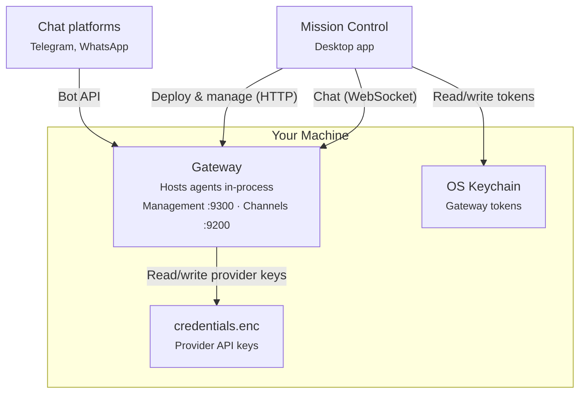

Dash is made up of two main pieces that work together to keep your agent team running.

## System overview



Dash has two main components:

- **Gateway** — Single long-running process that hosts all agents in memory, serves a WebSocket channel server at port 9200, exposes an HTTP management API at port 9300, and connects to external messaging platforms. Mission Control spawns it automatically on first launch and reuses it across MC restarts — the bearer token lives in the OS keychain, so a relaunched MC recognizes its own gateway without a fresh spawn.
- **Mission Control** — Electron desktop app. Main process hosts the supervisor that manages the gateway lifecycle, renderer is a React + Vite UI talking to the main process over IPC. Also available as a CLI for terminal users and automation.

### Deployment options

Dash is flexible about where each piece runs.

**Single machine** — run everything locally. Launch Mission Control, which spawns the gateway as a child process. Good for development and personal use.

**Headless** — run the gateway standalone on a VPS or server: `npm run gateway -- --config <path>`. Use the CLI or point Mission Control at the management URL for remote management.

## How your team is organized

<AccordionGroup>
  <Accordion title="LLM layer" icon="microchip">
    Abstraction over LLM provider APIs. Supports Anthropic (Claude), OpenAI (GPT), and Google (Gemini). Handles streaming responses, extended thinking blocks, and tool use blocks. Models use `provider/model` format (e.g. `anthropic/claude-sonnet-4-20250514`, `openai/gpt-4o`, `google/gemini-2.0-flash`) for automatic provider routing.
  </Accordion>
  <Accordion title="Agent" icon="robot">
    The core runtime. An agent manages conversations: it loads session history, sends messages to the LLM, executes tools when the model requests them, and persists everything to disk. Agents loop automatically — if the model asks to run a tool, the agent executes it and sends the result back until the model produces a final response (up to 25 rounds).
  </Accordion>
  <Accordion title="Channel server" icon="comments">
    WebSocket server (port 9200) for real-time agent interaction. Clients connect, send messages, and receive a stream of events (text deltas, tool executions, final responses) as they happen. Supports multiple concurrent conversations on a single connection via message ID correlation.
  </Accordion>
  <Accordion title="Management API" icon="tower-control">
    HTTP server (port 9300) for operational control. Provides health checks (`/health`), server info (`/info`), agent deployment, and graceful shutdown (`/lifecycle/shutdown`). Used by Mission Control to deploy and manage agents.
  </Accordion>
  <Accordion title="Gateway" icon="server">
    The main entry point. A single process that hosts agents in memory, runs both the channel server and management API, and owns all messaging platform connections. Reads config, creates agents with their assigned models and tools, and routes messages from external platforms (Telegram, WhatsApp) to agents. When deployed via Mission Control, secrets from the encrypted store are injected via the management API. Supports `--config` and `--token` CLI flags for standalone use.
  </Accordion>
  <Accordion title="Mission Control" icon="grid-2">
    Desktop app (Electron) and CLI for managing the gateway and agents. Spawns the gateway on first launch, stores the management token in the OS keychain, and communicates with the gateway over HTTP (management) and WebSocket (chat). Includes a tabbed chat interface, agent deployment wizard, and connector management. Provider API keys are stored in an AES-256-GCM encrypted file (`credentials.enc`).
  </Accordion>
</AccordionGroup>

## Gateway APIs

The gateway runs two servers with independent authentication:

| Server | Protocol | Default port | Auth | Purpose |
|--------|----------|-------------|------|---------|
| Management API | HTTP | 9300 | Bearer token | Health, info, deploy, shutdown |
| Channel server | WebSocket | 9200 | Query param (`?token=`) | Real-time agent chat |

Both servers bind to `127.0.0.1` by default. Each has its own token — a management token cannot be used on the channel port, and vice versa.

## Message flow

Here's what happens when you send a message to one of your agents.

<Steps>
  <Step title="Connect and authenticate">
    Client opens a WebSocket to `ws://host:9200/ws/chat?token=...`
  </Step>
  <Step title="Send a message">
    Client sends a JSON message with the agent name, conversation ID, and text
  </Step>
  <Step title="Agent processes">
    The agent loads the conversation's session history, appends the new message, and streams it to the LLM
  </Step>
  <Step title="Stream events">
    As the LLM responds, events are streamed back in real time — text deltas, tool executions, and tool results
  </Step>
  <Step title="Tool loop">
    If the model requests a tool (e.g., running a shell command), the agent executes it and sends the result back to the LLM. This can repeat up to 25 times per message
  </Step>
  <Step title="Final response">
    When the model finishes, the agent persists the full conversation and sends a completion signal
  </Step>
</Steps>

## WebSocket protocol

**Client → Server:**

| Type | Fields | Description |
|------|--------|-------------|
| `message` | `id`, `agent`, `channelId`, `conversationId`, `text` | Send a chat message |
| `cancel` | `id` | Cancel an in-flight request |

**Server → Client:**

| Type | Fields | Description |
|------|--------|-------------|
| `event` | `id`, `event` | A streaming event (text delta, tool use, response, etc.) |
| `done` | `id` | Stream complete for this request |
| `error` | `id`, `error` | Error message |

The `id` field correlates requests with responses, allowing multiple concurrent requests on a single connection.

## Session persistence

Conversations are stored as append-only JSONL files (one JSON object per line):

```
data/sessions/{channelId}/{conversationId}/session.jsonl
```

Each line records a timestamped event — user messages, assistant responses, and tool results. When an agent loads a session, it replays these entries to reconstruct the conversation history. This format is simple, crash-safe (partial writes don't corrupt earlier entries), and easy to inspect.

## Event log and chat replay

The gateway maintains a durable event log for each conversation. When a client reconnects (e.g. after Mission Control restarts), it can replay missed events from the log without re-sending the message to the LLM. This ensures chat continuity across reconnections.
