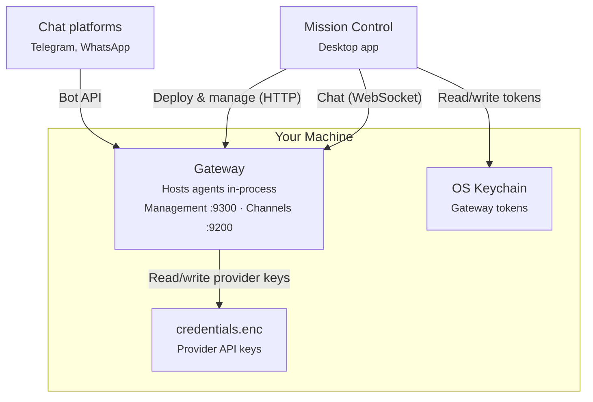

Dash is made up of two main pieces that work together to keep your agent team running.

## System overview


```mermaid
graph TB
  platforms["Chat platforms<br/><small>Telegram, WhatsApp</small>"]

  subgraph infra ["Your Machine"]
    gateway["Gateway<br/><small>Hosts agents in-process<br/>Management :9300 · Channels :9200</small>"]
    keychain["OS Keychain<br/><small>Gateway tokens</small>"]
    enc["credentials.enc<br/><small>Provider API keys</small>"]
  end

  mc["Mission Control<br/><small>Desktop app</small>"]

  platforms -- "Bot API" --> gateway
  mc -- "Deploy & manage (HTTP)" --> gateway
  mc -- "Chat (WebSocket)" --> gateway
  mc -- "Read/write tokens" --> keychain
  gateway -- "Read/write provider keys" --> enc
```

Dash has two main components:

- **Gateway** — Single long-running process that hosts all agents in memory, serves a WebSocket channel server at port 9200, exposes an HTTP management API at port 9300, and connects to external messaging platforms. Mission Control spawns it automatically on first launch and reuses it across MC restarts — the bearer token lives in the OS keychain, so a relaunched MC recognizes its own gateway without a fresh spawn.
- **Mission Control** — Electron desktop app. Main process hosts the supervisor that manages the gateway lifecycle, renderer is a React + Vite UI talking to the main process over IPC.

### Deployment options

Dash is flexible about where each piece runs.

**Single machine** — run everything locally. Launch Mission Control, which spawns the gateway as a child process. Good for development and personal use.

**Headless** — run the gateway standalone on a VPS, server, or in Docker: `npm run gateway`. Manage it through its [Management API](/api-reference), or point Mission Control at the management URL for remote management.

## How your team is organized

<AccordionGroup>
  <Accordion title="LLM layer" icon="microchip">
    Abstraction over LLM provider APIs. Supports Anthropic (Claude), OpenAI (GPT), and Google (Gemini). Handles streaming responses, extended thinking blocks, and tool use blocks. Models use `provider/model` format (e.g. `anthropic/claude-sonnet-4-20250514`, `openai/gpt-4o`, `google/gemini-2.0-flash`) for automatic provider routing.
  </Accordion>
  <Accordion title="Agent" icon="robot">
    The core runtime. An agent manages conversations: it loads session history, sends messages to the LLM, executes tools when the model requests them, and persists everything to disk. Agents loop automatically — if the model asks to run a tool, the agent executes it and sends the result back until the model produces a final response (up to 25 rounds).
  </Accordion>
  <Accordion title="Channel server" icon="comments">
    WebSocket server (port 9200) for real-time agent interaction. Clients connect, send messages, and receive a stream of events (text deltas, tool executions, final responses) as they happen. Supports multiple concurrent conversations on a single connection via message ID correlation.
  </Accordion>
  <Accordion title="Management API" icon="tower-control">
    HTTP server (port 9300) for operational control. Provides health checks (`/health`) plus CRUD for agents, channels, credentials, and models. Used by Mission Control to deploy and manage agents. See the [Management API reference](/api-reference).
  </Accordion>
  <Accordion title="Gateway" icon="server">
    The main entry point. A single process that hosts agents in memory, runs both the channel server and management API, and owns all messaging platform connections. Creates agents with their assigned models and tools, and routes messages from external platforms (Telegram, WhatsApp) to agents. Agents, channels, and credentials are created at runtime through the management API rather than a config file. Supports CLI flags (`--token`, `--data-dir`, …) for standalone use — see [Configuration](/configuration#running-the-gateway-standalone).
  </Accordion>
  <Accordion title="Mission Control" icon="grid-2">
    Desktop app (Electron) for managing the gateway and agents. Spawns the gateway on first launch, stores the management token in the OS keychain, and communicates with the gateway over HTTP (management) and WebSocket (chat). Includes a tabbed chat interface, shared conversation history, an agent deployment wizard, and connector management. Provider API keys are stored in an AES-256-GCM encrypted file (`credentials.enc`).
  </Accordion>
</AccordionGroup>

## Conversation history across devices

For gateways that advertise `conversation-sync-v1`, the gateway owns conversation metadata,
messages, revisions, active turns, and replay sequences. Mission Control keeps a
gateway-identity-scoped read cache so history remains visible offline, but it never treats that
cache as writable truth. A disconnected resumable chat socket detaches only that viewer; the
gateway turn continues until it completes or a client sends an explicit cancel.

Mission Control preserves its older local JSON/JSONL conversations separately. With a capable
gateway they appear as read-only **On this Mac** history. With a gateway that explicitly lacks
the capability, Mission Control keeps the original local-authoritative chat behavior.

## Gateway APIs

The gateway runs two servers with independent authentication:

| Server | Protocol | Default port | Auth | Purpose |
|--------|----------|-------------|------|---------|
| Management API | HTTP | 9300 | Bearer token | Health, agents, channels, credentials, models |
| Channel server | WebSocket | 9200 | Query param (`?token=`) | Real-time agent chat |

Both servers bind to `127.0.0.1` by default. Each has its own token — a management token cannot be used on the channel port, and vice versa.

## Remote access identity

When you use the [hosted relay](/remote-access) to reach your agents from your phone,
the gateway authenticates itself with its **own cryptographic identity** rather than a
shared password. On first start, the gateway generates an Ed25519 key pair and stores
the private half on its own disk (owner-readable only); the private key never leaves the
machine. Only the matching **public** key is ever registered with Dash, so the hosted
service holds nothing that could impersonate your gateway.

Gateways are owned by an **organization**, not by an individual login. When you set up
remote access you sign in to Dash and act on behalf of an organization; the gateways and
addresses you create belong to it, which is what lets you share access with teammates. The
hosted service only ever sees the organization a request belongs to — never a password.

Each gateway also has a **permanent address** on the relay — the hostname you chose when
you set up remote access. That address is globally unique and is claimed for good: it's
never reassigned and never recycled, even if you later remove the gateway, so a paired
phone always resolves the same gateway and a name can't be taken over by someone else.

Each time the gateway dials out to the relay, it presents its relay address token
together with a short-lived proof signed by that private key. The relay checks, offline,
that the token was issued by Dash for that exact address **and** that the dialer actually
holds the matching private key (holder-of-key) before it admits the connection. A token
copied from disk or seen on the wire is therefore inert on its own — without the private
key it produces no valid proof.

This also makes remote access self-healing. Relay address tokens are short-lived, and the
gateway renews its own token in the background — on a timer before it expires, on the next
dial after a rejected one, and on boot after being offline. So a gateway that's been
powered off for days or weeks reconnects on its own, with no re-enrollment and without
Mission Control needing to be open.

## Message flow

Here's what happens when you send a message to one of your agents.

<Steps>
  <Step title="Connect and authenticate">
    Client opens a WebSocket to `ws://host:9200/ws/chat?token=...`
  </Step>
  <Step title="Send a message">
    Client sends a message with a unique turn ID, agent ID, conversation ID, and text
  </Step>
  <Step title="Agent processes">
    The agent loads the conversation's session history, appends the new message, and streams it to the LLM
  </Step>
  <Step title="Stream events">
    As the LLM responds, events are streamed back in real time — text deltas, tool executions, and tool results
  </Step>
  <Step title="Tool loop">
    If the model requests a tool (e.g., running a shell command), the agent executes it and sends the result back to the LLM. This can repeat up to 25 times per message
  </Step>
  <Step title="Final response">
    When the model finishes, the agent persists the full conversation and sends a completion signal
  </Step>
</Steps>

Mission Control and the Dash phone app see the same active turn when they use the same capable
gateway. Either client can watch replayed output, answer a pending question, or explicitly cancel
the turn. Closing one client does not cancel shared work.

## WebSocket protocol

**Client → Server:**

| Type | Purpose |
|------|---------|
| `message` | Start a turn in a canonical conversation |
| `resume` | Resume a shared turn after the last received sequence |
| `answer` | Answer a question raised by the active turn |
| `cancel` | Explicitly cancel the active turn |

**Server → Client:**

| Type | Purpose |
|------|---------|
| `accepted` | Confirm the canonical turn and message identities |
| `event` | Deliver a sequence-bearing text, tool, question, or response event |
| `done` | Deliver the terminal completed or cancelled outcome |
| `error` | Deliver a structured rejection or terminal failure |

The turn ID correlates requests with responses. Sequence numbers let reconnecting clients request
only missing events and ignore duplicates. See the [API reference](/api-reference) for detailed
payload fields and error shapes.

## Conversation and provider session persistence

The canonical conversation record is what Mission Control and paired phone apps render. It owns
the shared title, agent-name snapshot, messages, status, revision, and active turn.

Separately, the agent runtime stores provider session state as append-only JSONL files (one JSON
object per line), under a directory keyed by agent and conversation:

```
~/.dash/gateway/sessions/{agent-name}/{conversationId}/
```

Each line records provider-facing context such as user messages, assistant responses, and tool
results. When an agent loads a session, it replays these entries to restore model context. These
provider session files are distinct from the canonical rendered conversation history shared by
Mission Control and mobile clients.

## Event log and chat replay

The gateway maintains a durable event log for each conversation. When a client reconnects (e.g. after Mission Control restarts), it can replay missed events from the log without re-sending the message to the LLM. This ensures chat continuity across reconnections.

## Agent Swarm

When an agent has [swarm](/configuration#swarm) enabled, a single chat turn can fan out into an **orchestrator** plus several short-lived **worker** subagents that run in parallel. The orchestrator is the agent you're chatting with; a worker is a stripped-down agent — no MCP, no skills, no plugin tools — that shares the orchestrator's workspace but runs in its own isolated context from a self-contained brief.

**Turn-scoped.** A swarm run lives **within one chat turn**. The gateway's swarm coordinator keys each run by `agentId/conversationId`: only the live turn can spawn or finalize it, and when the turn ends the run is finalized, any still-running workers are settled, and its worker pool is torn down. Workers do not outlive the message that spawned them.

**Data flow.**

<Steps>
  <Step title="Orchestrator spawns workers">
    Using `spawn_worker`, the orchestrator hands each worker a role, a brief, a model, and a tool subset. The coordinator enforces per-agent and global caps before creating the worker.
  </Step>
  <Step title="Workers run in parallel">
    Each worker is its own agent backend running on the shared workspace. It works from its brief and can call `ask_orchestrator` to pause and ask a blocking question.
  </Step>
  <Step title="Worker events ride the chat stream">
    The coordinator's per-run event channel is **merged into the orchestrator's own `AgentEvent` stream**, so `worker_spawned`, `worker_status`, and `worker_done` events interleave with the orchestrator's text and tool events over the same WebSocket. These events are **self-describing** (they carry the worker's role, model, and report), which is what lets Mission Control draw one card per worker — live, and identically when replayed from history.
  </Step>
  <Step title="Orchestrator collects and synthesizes">
    The orchestrator uses `wait_workers` to collect reports (and `send_to_worker` to answer or steer), then writes one final answer built from the workers' reports. That final response is what channels like Telegram receive — intermediate worker events are for Mission Control only.
  </Step>
</Steps>

**Supervision via the management API.** Mission Control's **swarm panel** reads live and recent runs over the [Management API](/api-reference) (`GET /agents/:id/swarm/runs` and `/runs/:runId`) and can cancel a worker or send it a message (`POST …/workers/:workerId/cancel` and `…/send`). A cancel or send against a worker that has already finished — or a run that has been finalized — returns **409**, which the panel surfaces as a dismissable notice rather than an error. Worker transcripts are persisted under `sessions/<agent-name>/.swarm/<runId>/<workerId>/` and kept for inspection.
