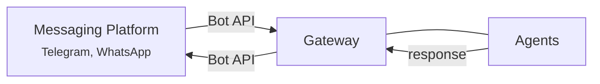

Messaging apps let your agents talk to people on platforms they already use. Connect a Telegram bot or WhatsApp number, set up routing rules, and your agents start responding to messages automatically.

## How it works

Messages flow through a simple chain:



1. A user sends a message on Telegram (or WhatsApp)
2. The **Gateway** receives it through the platform's bot API
3. Routing rules determine which **agent** should handle it
4. The agent processes the message — thinking, using tools, and building a response
5. The response flows back through the Gateway to the messaging platform

The user sees a normal chat conversation. Behind the scenes, your agent is doing all the work.

## Supported platforms

<CardGroup cols={2}>
  <Card title="Telegram" icon="paper-plane">
    Connect a Telegram bot to your agents. Supports individual and group chats, user allow lists, and per-sender routing.
  </Card>
  <Card title="WhatsApp" icon="phone">
    Connect a WhatsApp number to your agents. Same routing and access control features as Telegram.
  </Card>
</CardGroup>

More platforms are planned. The Gateway uses an adapter pattern, so adding a new platform does not change how routing or agent interaction works.

## Setting up Telegram

<Steps>
  <Step title="Create a bot with BotFather">
    Open Telegram and search for **@BotFather**. Send `/newbot`, follow the prompts, and copy the bot token it gives you. The token looks like `123456789:ABCdefGhIjKlmNoPqRsTuVwXyZ`.
  </Step>
  <Step title="Add the bot in Mission Control">
    Open Mission Control's **Messaging Apps** page and click to add a new Telegram connection. Give it a name (e.g. "Support Bot") and paste your bot token. The token is stored in the encrypted secret store.
  </Step>
  <Step title="Configure routing rules">
    Set up rules that tell the Gateway which agent should receive messages from this bot. You can route all messages to a single agent, or create more specific rules based on sender or group.
  </Step>
  <Step title="Enable the connection">
    Toggle the connection on. The Gateway connects to Telegram's bot API and starts listening for messages. Your agent is now reachable on Telegram.
  </Step>
</Steps>

<Accordion title="Without Mission Control">
  Channels aren't configured with a file — they're created at runtime through the gateway's [Management API](/api-reference#channels). Mission Control is just a friendly front-end for that API.

  To set one up against a standalone gateway, `POST /channels` with the adapter, token, routing rules, and access lists, then enable it. See the [Management API](/api-reference#channels) reference.
</Accordion>

## Setting up WhatsApp

<Steps>
  <Step title="Get your WhatsApp credentials">
    Set up a WhatsApp Business API account and obtain your access credentials.
  </Step>
  <Step title="Add the connection in Mission Control">
    Open the **Messaging Apps** page, add a new WhatsApp connection, and enter your credentials. They are encrypted and stored securely.
  </Step>
  <Step title="Configure routing rules">
    Just like Telegram — define which agent handles incoming messages.
  </Step>
  <Step title="Enable the connection">
    Turn it on and your agent starts responding to WhatsApp messages.
  </Step>
</Steps>

## Routing rules

Routing rules control which agent receives messages from each messaging app. Rules are evaluated in order — the first match wins.

### Rule types

| Type | What it matches | Example |
|------|----------------|---------|
| **Default** | All messages that do not match another rule | Route everything to the general assistant |
| **Sender** | Messages from specific user IDs | Route messages from `@alice` to the research agent |
| **Group** | Messages from specific group chats | Route messages in the "Engineering" group to the coder agent |

### How rules work together

Rules are checked top to bottom. The first rule that matches determines which agent gets the message. A **default** rule at the bottom acts as a catch-all.

```
Rule 1: Messages from @alice → research-agent
Rule 2: Messages from Engineering group → coder-agent
Rule 3: Default → general-assistant
```

In this example, Alice always talks to the research agent. Messages in the Engineering group go to the coder. Everyone else reaches the general assistant.

### Access control

Each messaging app also has access control lists:

- **Global deny list** — Block specific users from reaching any agent through this messaging app. Evaluated before any routing rules.
- **Per-rule allow list** — Restrict a routing rule to specific senders. If set, only listed senders can reach the agent through that rule.
- **Per-rule deny list** — Block specific senders from a routing rule, even if they would otherwise match.

<Warning>
  The global deny list is checked first. If a sender is on the deny list, their messages are ignored regardless of routing rules.
</Warning>

## The Gateway

The Gateway is the process that hosts agents and handles all messaging platform connections. It takes care of:

- Connecting to each platform's bot API
- Receiving incoming messages
- Evaluating routing rules
- Forwarding messages to the correct agent via the Chat API
- Sending agent responses back to the platform

The Gateway hosts agents in-process and serves the channel server on port 9200. Mission Control's built-in chat connects to the same channel server over WebSocket.

<AccordionGroup>
  <Accordion title="How channels are stored">
    Each channel records its adapter type, bot token, routing rules, and access lists, and which agent to route to. The gateway persists channels to `~/.dash/gateway/channels.json` and connects each adapter on startup. Edits made through Mission Control (or `PUT /channels/:name`) take effect on the next message — no restart needed. Because the gateway hosts agents in-process, there are no separate agent server URLs to wire up.
  </Accordion>
  <Accordion title="Running the Gateway manually">
    ```bash
    npm run gateway
    ```

    The gateway starts on its data directory (`~/.dash/gateway`), reconnects any saved channels, and begins routing. Create or edit channels through its [Management API](/api-reference#channels), and supply bot tokens the same way (`POST /credentials`). It runs until stopped. See [Configuration](/configuration#running-the-gateway-standalone) for the available flags.
  </Accordion>
  <Accordion title="Mission Control integration">
    When you manage messaging apps through Mission Control, the gateway is handled automatically. Mission Control:

    1. Saves your channel settings to the gateway via the Management API
    2. Stores bot tokens in the encrypted credential store
    3. Keeps the gateway process running
    4. Routes Mission Control's built-in chat through the gateway

    There's nothing to configure by hand.
  </Accordion>
</AccordionGroup>

## What's next

<CardGroup cols={2}>
  <Card title="Agents" icon="robot" href="/agents">
    Learn how agents are configured and how they process messages.
  </Card>
  <Card title="Chat" icon="messages" href="/chat-with-your-agent">
    Talk to agents via Mission Control, Telegram, or WebSocket API.
  </Card>
  <Card title="Mission Control" icon="grid-2" href="/mission-control">
    Deploy agents and manage messaging apps from the desktop app.
  </Card>
  <Card title="Architecture" icon="sitemap" href="/architecture">
    How the Gateway and Mission Control fit together.
  </Card>
</CardGroup>
