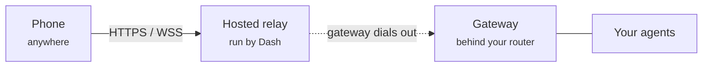

By default the Dash phone app connects to your gateway over your local Wi-Fi. The
**hosted relay** lets you reach the same agents from anywhere — on cellular, at
the office, travelling — without opening any ports on your home network.

<Note>
The hosted relay is run by Dash. You sign in to your Dash account, create a
gateway, and pair your phone — there's no server to set up and no domain to buy.
Your conversations and login tokens pass through the relay as sealed bytes; the
relay forwards them but never reads them.
</Note>

## When you need it

<CardGroup cols={2}>
  <Card title="Use the relay" icon="globe">
    You want to chat with your agents from your phone while away from home, where
    your phone and the gateway are on different networks.
  </Card>
  <Card title="Skip the relay" icon="wifi">
    Your phone and the machine running Dash are on the same Wi-Fi. Just pair over
    the local network — no relay needed.
  </Card>
</CardGroup>

## How it works

The relay is a **reverse tunnel**. Your gateway dials *out* to the relay (outbound
connections pass through home routers and firewalls), and the relay forwards your
phone's requests back down that connection.

The relay just passes encrypted bytes along — it never reads your messages or your
gateway's login tokens. Your Dash sign-in identifies you, each gateway gets its own
address, and every phone you pair carries its own credential — so the relay only
ever connects *your* phones to *your* gateway.

## Set it up

<Steps>
  <Step title="Sign in to Dash">
    In Mission Control, open **Settings → Remote access** and click **Sign in to
    Dash**. Your browser opens to the Dash sign-in page. Sign in, and the browser
    hands you back to Mission Control automatically. You only do this once per
    machine.
  </Step>
  <Step title="Create a gateway">
    Once you're signed in, click **Create gateway**. Dash gives your gateway a
    stable address on the relay and restarts it so it connects out. When it's
    ready you'll see **Gateway ready at** followed by your gateway's address.
  </Step>
  <Step title="Pair your phone by QR">
    Open **Pair Device**. With a gateway created, the QR code now carries your
    relay address and a per-device credential. Scan it with the Dash Android app —
    your phone connects through the relay from then on, wherever you are.
  </Step>
</Steps>

<Tip>
Every phone you pair gets its own credential, so you can pair as many devices as
you like and manage them one at a time.
</Tip>

## Manage your devices

Back on **Settings → Remote access**, the **Paired devices** list shows every
phone connected to your gateway. To disconnect one — a phone you've lost, sold, or
no longer use — click **Revoke** next to it. That device can no longer reach your
agents through the relay; your other devices keep working untouched.

<Tip>
A revoked phone simply needs to be paired again to come back. Open **Pair Device**,
scan a fresh QR code on that phone, and it gets a new credential.
</Tip>

## Signing out

Signing out of Dash on this machine stops new gateways and pairings from being
created here. Your gateway keeps its stable address, so signing back in later picks
up right where you left off.
