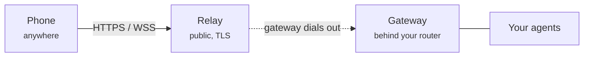

By default the Dash phone app connects to your gateway over your local Wi-Fi. The
**relay** lets you reach the same agents from anywhere — on cellular, at the
office, travelling — without opening any ports on your home network.

<Note>
The relay is **self-hosted**: you run a small relay service on a server with a
domain name, and every gateway you own connects out to it. Nothing about your
conversations passes through Dash's servers.
</Note>

## When you need it

<CardGroup cols={2}>
  <Card title="Use the relay" icon="globe">
    You want to chat with your agents from your phone while away from home, where
    your phone and the gateway are on different networks.
  </Card>
  <Card title="Skip the relay" icon="wifi">
    Your phone and the machine running Dash are on the same Wi-Fi. Just pair over
    the local network — no relay needed.
  </Card>
</CardGroup>

## How it works

The relay is a **reverse tunnel**. Your gateway dials *out* to the relay (outbound
connections pass through home routers and firewalls), and the relay forwards your
phone's requests back down that connection.

The relay just passes encrypted bytes along — it never reads your messages or your
gateway's login tokens. Three independent secrets keep it locked down: the relay
only admits *your* gateway, only admits *your* paired phones, and your gateway
still checks its own tokens on every request.

## Set it up

<Steps>
  <Step title="Run a relay">
    Deploy the relay on a server with a wildcard domain (for example
    `*.relay.example.com`) and TLS. The
    [relay guide](https://github.com/volumegambit/Dash/blob/main/apps/relay/README.md)
    has a copy-paste setup using Caddy and systemd. You'll choose two secrets: a
    **relay token** and an **admin secret**.
  </Step>
  <Step title="Connect Mission Control to your relay">
    In Mission Control, open **Settings → Remote access (relay)** and enter your
    relay domain, relay token, and admin secret — the same values you configured
    on the relay. Click **Enable relay**. The gateway restarts and connects to
    your relay automatically.
  </Step>
  <Step title="Pair your phone over the relay">
    Open **Pair Device**. With the relay enabled, the QR code now carries your
    relay address and a per-device credential. Scan it with the Dash Android app —
    your phone connects through the relay from then on, wherever you are.
  </Step>
</Steps>

<Tip>
Every phone you pair gets its own credential. To revoke a single device later,
disable then re-enable the relay, or un-pair it — the other devices keep working.
</Tip>

## Turning it off

In **Settings → Remote access (relay)**, click **Disable relay**. The gateway
goes back to local-network-only pairing. Your relay settings are forgotten, but
your gateway keeps its stable address, so re-enabling later reuses it.

<Warning>
If Mission Control can't reach your relay when you enable it (wrong domain, relay
not running, wrong admin secret), the Pair Device screen shows the error. Check
that your relay is up and the domain, token, and admin secret match exactly.
</Warning>
