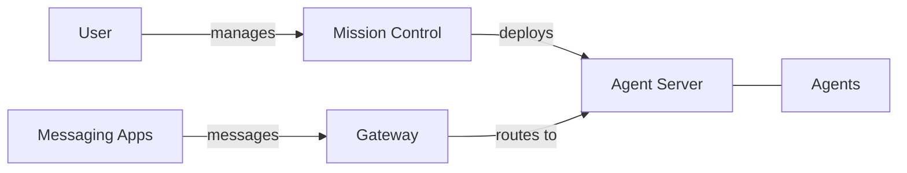

<Warning>
  **Alpha Software** — Dash is under heavy development. APIs, configuration, and features may change without notice.
</Warning>

## The Big Picture

You define AI agents, deploy them through Mission Control, optionally connect them to messaging apps like Telegram, and interact with them through chat. Agents run autonomously — thinking, using tools, and responding to messages. The whole system runs on your machine, and you stay in control of every piece.

## Agents

An agent is an AI model paired with a system prompt, tools, and skills. Agents run autonomously: they receive messages, reason about them, use tools to take action, and respond. Each agent is configured independently — different models, different tools, different instructions. Agents persist conversations as sessions so they maintain context across messages.

[Learn more about Agents](/agents)

## Mission Control

Mission Control is your command center for the entire system. Deploy new agents, monitor running ones, view logs, and edit configuration — all from a desktop app. It includes a built-in chat interface to talk to your agents directly. Mission Control is also available as a CLI for terminal users and automation.

[Learn more about Mission Control](/mission-control)

## AI Providers

Agents need an AI model to think — you bring your own API key. Dash supports Anthropic (Claude), OpenAI (GPT), and Google (Gemini). Each agent can use a different provider, and you can set fallback models in case one is unavailable.

[Learn more about AI Providers](/ai-providers)

## Deploying an Agent

When you deploy an agent through Mission Control, it starts as a background process with its own workspace, ports, and log stream. You can start, stop, restart, and remove deployments at any time. Configuration changes — model, tools, system prompt — can be made on the fly.

[Deploy Your First Agent](/deploy-your-first-agent)

## Messaging Apps

Connect your agents to external chat platforms like Telegram and WhatsApp. The Gateway sits between messaging platforms and your agents, routing conversations based on rules you define. One agent can serve multiple messaging apps, and one app can route to different agents.

[Learn more about Messaging Apps](/messaging-apps)

## Skills

Skills are reusable instruction sets that extend what an agent knows how to do. Agents discover skills automatically from local directories or remote URLs, and load them on demand. You can create custom skills through Mission Control or let agents create their own.

[Learn more about Skills](/skills)

## Tools

Tools are capabilities agents use to interact with the outside world — run shell commands, read files, edit code, search directories. Each tool is sandboxed to the agent's workspace directory for safety. You choose which tools each agent has access to in its configuration.

[Learn more about Tools](/tools)

## Secrets & Security

API keys and sensitive credentials are encrypted at rest using AES-256-GCM. The encryption key is derived from a password you set and cached in your OS keychain. Agents run in sandboxed workspace directories, and your data never leaves your machine except to your chosen AI provider.

[Learn more about Secrets](/secrets)

## Chat

Talk to your agents through Mission Control's built-in chat, through connected messaging apps like Telegram, or programmatically via the WebSocket API. Messages stream in real time — you see the agent thinking, using tools, and building its response as it goes. Conversations persist as sessions, so agents remember previous context.

[Chat with Your Agent](/chat-with-your-agent)

## What's Next

<CardGroup cols={3}>
  <Card title="Get started" icon="rocket" href="/getting-started">
    Install Dash and launch your first agent.
  </Card>
  <Card title="Deploy an agent" icon="play" href="/deploy-your-first-agent">
    Step-by-step guide to deploying through Mission Control.
  </Card>
  <Card title="Example agents" icon="book" href="/example-agents">
    Ready-made configurations to get you started.
  </Card>
</CardGroup>
